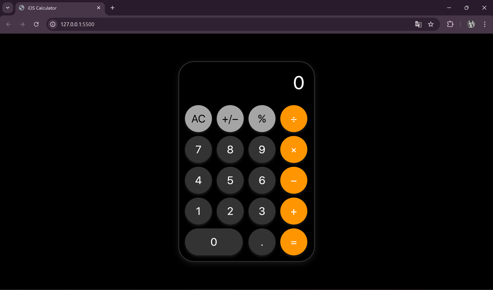

# 📱 iOS Calculator

A simple, responsive **iOS-style calculator** built using **HTML, CSS, and JavaScript**.

---

## ✨ Features

✅ **iOS-Inspired UI** – A sleek and modern design 🎨  
✅ **Basic Calculations** – Addition, subtraction, multiplication, and division ➕➖✖️➗  
✅ **Keyboard Support** – Use keyboard shortcuts for input ⌨️  
✅ **Responsive Design** – Works on desktop and mobile 📱💻  
✅ **Lightweight & Fast** – Optimized for smooth performance ⚡  

---

## 📸 Screenshot



---

## 🛠 Technologies Used

- **HTML5** – Structure & elements  
- **CSS3** – Styling & layout  
- **JavaScript (ES6)** – Logic & functionality  

---

## 📥 Installation Guide

Follow these steps to run the project locally:

1. **Clone the Repository**
   ```sh
   git clone https://github.com/Brainstorm-collab/iOS-Calculator.git
